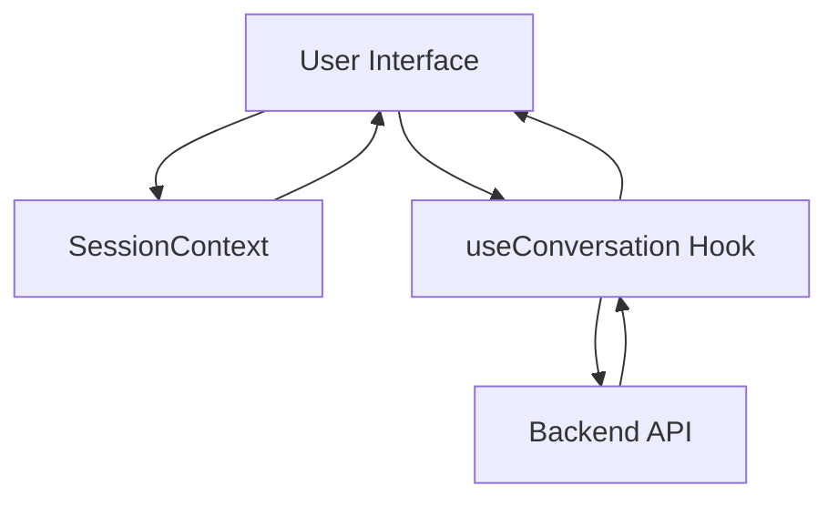
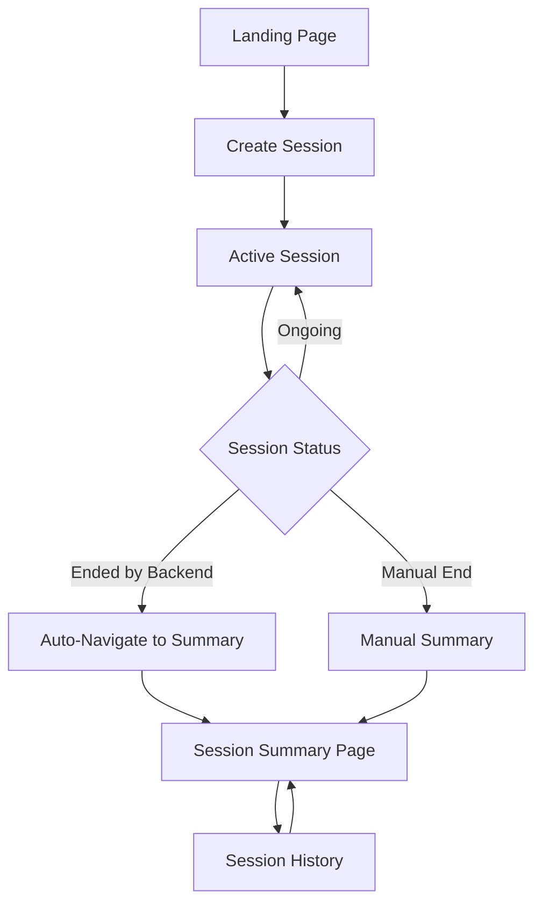
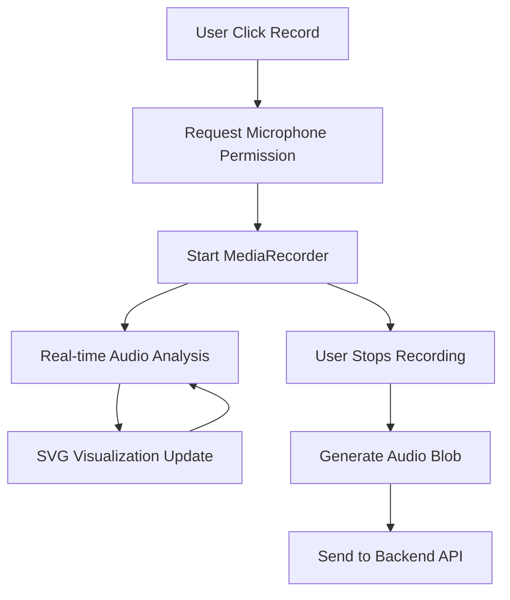
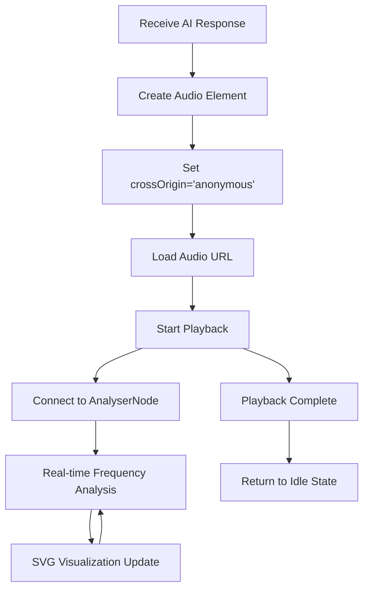

# Kuku Coach Frontend Architecture Documentation

## Project Overview

**Kuku Coach** is an AI-powered voice coaching assistant that operates on web and mobile browsers. The application facilitates real-time voice-based coaching sessions between users and an AI coach, with sophisticated audio processing, visualization, and session management.

### Core Functionality
- **Voice-First Interface**: Users speak to the AI coach and receive spoken responses
- **Real-Time Audio Processing**: Live audio visualization during recording and playback
- **Session Management**: Persistent conversation sessions with history and summaries
- **Responsive Design**: Optimized for both desktop and mobile devices
- **Progressive Enhancement**: Works across modern browsers with graceful degradation

---

## Frontend Technology Stack

### Core Framework & Build Tools
- **Framework**: React 18 with TypeScript
- **Build Tool**: Vite (development server on port 8080)
- **Package Manager**: npm
- **Node Environment**: ESM modules

### UI & Styling
- **UI Framework**: Shadcn UI (built on Radix UI primitives)
- **Styling**: Tailwind CSS with utility-first approach
- **Icons**: Lucide React
- **Theme**: Dark/light mode support with next-themes
- **Typography**: Tailwind Typography plugin

### State Management & Data Flow
- **Global State**: React Context API
- **Component State**: React useState/useReducer hooks
- **Session Management**: Custom SessionContext provider
- **Conversation Logic**: Custom useConversation hook
- **Form Management**: React Hook Form with Zod validation

### Audio Processing & Media
- **Audio Recording**: MediaRecorder API (WebM/Opus format)
- **Audio Analysis**: Web Audio API (AudioContext, AnalyserNode)
- **Visualization**: SVG-based real-time frequency analysis
- **Playback**: HTML5 Audio API with CORS support
- **Permission Handling**: Microphone access with error handling

### Routing & Navigation
- **Router**: React Router v6 with nested routing
- **Route Structure**: 
  - `/` - Landing page
  - `/session/:sessionId` - Active session
  - `/summary/:sessionId` - Session summary
  - `/history/:sessionId` - Session history

### Development & Quality
- **Linting**: ESLint with React hooks and TypeScript rules
- **Testing**: Vitest with React Testing Library and jsdom
- **Type Safety**: Strict TypeScript configuration
- **Code Quality**: Enforced via ESLint and TypeScript

---

## Architecture Patterns

### Component Architecture
```
App (Router Provider)
├── SessionProvider (Global State)
├── ThemeProvider (UI Theming)
└── Pages
    ├── LandingPage
    ├── KukuCoach (Main Session Interface)
    ├── SessionSummaryPage
    └── SessionHistoryPage
```

### State Management Pattern
- **SessionContext**: Global session state (ID, status, errors)
- **useConversation**: Conversation-specific logic and API communication
- **Component State**: Local UI state and temporary data
- **localStorage**: Session persistence and recovery

### Data Flow Architecture


---

## API Integration Architecture

### Current API Client Configuration

**Base URL Configuration**:
```typescript
// Environment-based configuration
const getBackendUrl = (): string => {
  // Priority: Environment variable
  const envUrl = import.meta.env.VITE_API_BASE_URL;
  if (envUrl) return envUrl;
  
  // Fallback: Development default
  return 'http://localhost:8000/api';
};
```

**Environment Variables**:
- `VITE_API_BASE_URL`: Backend API base URL
- Development: `http://localhost:8000/api`
- Production: Set via hosting platform environment variables

### API Client Implementation

**Real Backend Integration**:
- Direct HTTP communication with backend API
- Health checking before API calls
- Automatic fallback to mock implementation if backend unavailable
- Comprehensive error handling with user-friendly messages

**Request/Response Flow**:
1. **Session Creation**: `POST /api/sessions` → Creates session with backend
2. **Audio Submission**: `POST /api/sessions/{id}/audio` → Sends audio blob for processing
3. **History Retrieval**: `GET /api/sessions/{id}/messages` → Fetches conversation history
4. **Session Ending**: Auto-detection via API response or manual termination

---

## Session Management System

### Session Lifecycle


### Session States
- **idle**: Ready for user input
- **recording**: Capturing user audio
- **processing**: "Thinking" state during API call
- **responding**: Playing AI response
- **session-ended**: Backend-triggered session termination
- **error**: Error state with recovery options

### Session Persistence
- Session ID stored in localStorage for recovery
- URL-based session routing for direct access
- Conversation history persistence during navigation
- Summary data persistence between Summary ↔ History navigation

---

## Audio Processing Pipeline

### Recording Flow


### Playback Flow


### Audio Format Support
- **Recording**: WebM/Opus (primary), WAV (fallback)
- **Playback**: MP3 from backend with CORS headers
- **Analysis**: Real-time frequency domain analysis (FFT)
- **Visualization**: Multi-layered SVG with frequency bands

---

## Backend API Requirements

### Expected API Endpoints

#### 1. Session Management
```typescript
// Create Session
POST /api/sessions
Response: { sessionId: string }

// Session Status  
GET /api/sessions/{sessionId}
Response: { sessionId, status, messageCount, createdAt, updatedAt }

// End Session
PUT /api/sessions/{sessionId}/end
Response: { summaryText: string }
```

#### 2. Conversation Flow
```typescript
// Send Audio & Get Response
POST /api/sessions/{sessionId}/audio
Content-Type: multipart/form-data
Body: audio file blob

Response: {
  messageId: string;
  text: string;
  audioUrl: string;
  sessionEnded?: boolean;        // Auto-session ending
  finalSummary?: string;         // Summary when session ends
}

// Get Conversation History
GET /api/sessions/{sessionId}/messages
Response: {
  messages: Array<{
    id: string;
    timestamp: string;
    sender: 'user' | 'ai';
    text: string;
    audioUrl?: string;
  }>
}
```

### Critical Backend Requirements

**CORS Configuration**:
```javascript
// Required CORS headers for audio playback
'Access-Control-Allow-Origin': '*'
'Access-Control-Allow-Methods': 'GET, POST, PUT, DELETE, OPTIONS'
'Access-Control-Allow-Headers': 'Content-Type, Authorization'
```

**Audio File Serving**:
- Serve audio files with proper MIME types (`audio/mpeg` for MP3)
- Enable CORS for audio resources
- Support for relative or absolute URLs in `audioUrl` field
- Consider CDN for audio file delivery in production

**Session Ending Logic**:
- Backend can automatically end sessions by returning `sessionEnded: true`
- Frontend detects this and auto-navigates to summary
- Optional `finalSummary` field for backend-generated summaries
- Graceful handling of network errors during session transitions

---

## Mobile Optimization

### Responsive Design
- **Viewport**: Mobile-first design with dynamic viewport height
- **Touch Interactions**: Large touch targets (min 44px)
- **Layout**: 2x2 grid statistics, optimized spacing
- **Scrolling**: Custom thin scrollbars (4px width)
- **Performance**: Optimized for mobile browsers

### PWA Readiness
- Service worker support ready for implementation
- Manifest file structure prepared
- Offline capability architecture planned
- App-like experience on mobile devices

---

## Development Environment

### Local Development Setup
```bash
# Install dependencies
npm install

# Start development server
npm run dev
# Server: http://localhost:8080

# Build for production
npm run build

# Preview production build
npm run preview
```

### Environment Configuration
```bash
# Copy environment template
cp env.example .env.local

# Set backend URL
echo "VITE_API_BASE_URL=http://localhost:8000/api" > .env.local
```

### Development Tools
- **Dev Server**: Vite with HMR on port 8080
- **Proxy**: No proxy needed - direct API calls to backend
- **Debugging**: React DevTools, comprehensive console logging
- **Hot Reload**: Instant updates during development

---

## Deployment Architecture

### Production Build
- **Build Command**: `npm run build`
- **Output Directory**: `dist/`
- **Asset Optimization**: Automatic minification and bundling
- **Environment Variables**: Set via hosting platform

### Hosting Configuration (Netlify/Vercel)
```toml
# netlify.toml
[build]
command = "npm run build"
publish = "dist"

[[redirects]]
from = "/*"
to = "/index.html"
status = 200
```

### Environment Variables Setup
```bash
# Production environment variable
VITE_API_BASE_URL=https://your-backend-url.com/api
```

---

## Error Handling & Resilience

### Error Recovery Patterns
- **Network Errors**: Graceful degradation with retry logic
- **Audio Errors**: Fallback mechanisms for unsupported formats
- **Permission Errors**: Clear user guidance for microphone access
- **Session Errors**: Automatic session recovery and restart options

### Logging & Monitoring
- **Console Logging**: Structured logging with timestamps
- **Error Tracking**: Ready for error monitoring service integration
- **Performance Metrics**: Audio processing timing and API response times
- **User Analytics**: Session completion and interaction tracking ready

---

## Integration Testing Recommendations

### API Testing Checklist
- [ ] Session creation with valid session ID
- [ ] Audio upload with proper file format handling
- [ ] CORS headers working for audio playback
- [ ] Conversation history retrieval
- [ ] Automatic session ending detection
- [ ] Error responses with proper HTTP status codes

### Performance Testing
- [ ] Audio processing latency under 2 seconds
- [ ] Large audio file handling (up to 60 seconds)
- [ ] Concurrent session handling
- [ ] Mobile network performance
- [ ] CDN performance for audio delivery

---

## Security Considerations

### Client-Side Security
- **Content Security Policy**: Ready for CSP implementation
- **XSS Protection**: Sanitized user input and safe HTML rendering
- **CORS**: Proper CORS configuration for cross-origin requests
- **Environment Variables**: Sensitive data via environment variables only

### Data Privacy
- **Audio Data**: Temporary audio blobs, no local storage of audio
- **Session Data**: Minimal data persistence in localStorage
- **User Privacy**: No personal data collection in frontend
- **HTTPS**: Production deployment requires HTTPS

---

## Questions for Backend Team

### Architecture Questions
1. **Database Design**: How are you planning to structure conversations and sessions?
2. **Audio Storage**: Will you use cloud storage (S3, etc.) or local file system for audio files?
3. **Session Management**: How long should sessions persist? Any automatic cleanup?

### API Design Questions  
1. **Authentication**: Do you plan to implement user authentication or keep it sessionless?
2. **Rate Limiting**: What are your plans for rate limiting and abuse prevention?
3. **Audio Processing**: Are you using specific AI services (OpenAI, etc.) that might affect response times?

### Deployment Questions
1. **CORS Configuration**: Can you ensure proper CORS headers for cross-origin requests?
2. **CDN Setup**: Do you plan to use a CDN for audio file delivery?
3. **Health Checking**: Can you implement a `/health` endpoint for frontend health checks?

### Performance Questions
1. **Response Times**: What's the expected latency for audio processing?
2. **File Limits**: What are the maximum audio file size and duration limits?
3. **Concurrent Users**: How many simultaneous sessions should the system support?

---

## Additional Technical Details

### Browser Compatibility
- **Target Browsers**: Modern browsers with ES2020+ support
- **Audio API Support**: Requires Web Audio API and MediaRecorder
- **Fallback Handling**: Graceful degradation for limited browser features

### Performance Optimizations
- **Code Splitting**: Automatic route-based code splitting
- **Asset Optimization**: Vite's built-in optimization for production
- **Lazy Loading**: Component-based lazy loading ready for implementation
- **Bundle Analysis**: Built-in bundle analyzer for optimization

This documentation provides a complete picture of the frontend architecture. The frontend is production-ready and fully prepared for backend integration. All API endpoints, data formats, and error handling patterns are clearly defined and implemented. 