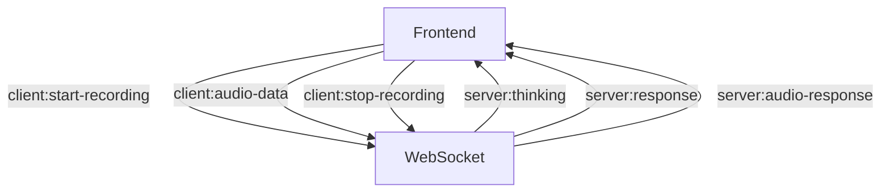

# Kuku Coach: Phase 5 Development Plan - REST API Integration

## Overview

Phase 5 focuses on transitioning from the WebSocket-based backend communication to a REST API approach. This change will simplify the architecture, improve reliability, and provide a more predictable state management model for the Kuku Coach application.

## Architecture Changes

### From WebSocket to REST API

**Current Architecture (WebSocket):**


**New Architecture (REST API):**
```mermaid
flowchart TD
    FRONT[Frontend] -->|POST /api/sessions/create| API[REST API]
    FRONT -->|POST /api/sessions/{id}/audio| API
    FRONT -->|GET /api/sessions/{id}/history| API
    FRONT -->|PUT /api/sessions/{id}/end| API
    API -->|Response with text and audio URL| FRONT
```

### Key Changes

1. **Session-Based Architecture**:
   - Create session at startup
   - Include session ID with all requests
   - Maintain conversation context on the backend

2. **Simplified Message Exchange**:
   - One REST call replacing multiple WebSocket events
   - Single combined response with both text and audio URL
   - Clear request-response pattern

3. **State Management**:
   - More predictable state transitions
   - Frontend-managed "thinking" state
   - Clearer error handling with HTTP status codes

## Implementation Plan

### Stage 1: API Service Implementation

**Objective:** Create a new REST API service layer to replace WebSocket functionality.

**Tasks:**
1. **Create API Service Structure**
   - Implement `/services/api/session.ts` with:
     - `createSession()`: Initialize a new conversation session
     - `sendAudio(sessionId, audioBlob)`: Send audio and get AI response
     - `getHistory(sessionId)`: Retrieve conversation history
     - `endSession(sessionId)`: End current session

2. **Mock Response Implementation**
   - Create mock responses that mirror the expected production API
   - Implement simulated processing delays
   - Generate AI responses with text and audio URLs

3. **Error Handling**
   - Implement proper error handling for API failures
   - Add retry logic for transient errors
   - Create user-friendly error messages

**API Interface Example:**
```typescript
interface SessionAPI {
  createSession(): Promise<{ sessionId: string }>;
  
  sendAudio(
    sessionId: string, 
    audioBlob: Blob
  ): Promise<{
    messageId: string;
    text: string;
    audioUrl: string;
  }>;
  
  getHistory(sessionId: string): Promise<Message[]>;
  
  endSession(sessionId: string): Promise<void>;
}
```

### Stage 2: Session Context Updates

**Objective:** Update SessionContext to handle session initialization and management.

**Tasks:**
1. **Session Initialization**
   - Add logic to create session on component mount
   - Store session ID in context and localStorage
   - Add session recovery on page reload

2. **Message Management**
   - Update message structure to align with API response
   - Implement history retrieval and display
   - Maintain consistent message format

3. **State Transitions**
   - Update status management (idle, recording, processing, responding)
   - Ensure smooth transitions between states
   - Handle error states appropriately

**SessionContext Interface Updates:**
```typescript
interface SessionContextType {
  // Existing properties
  sessionId: string | null;
  messages: Message[];
  status: SessionStatus;
  error: string | null;
  
  // New or updated methods
  startSession(): Promise<void>;
  endSession(): Promise<void>;
  addMessage(message: Message): void;
  setStatus(status: SessionStatus): void;
  setError(error: string | null): void;
}
```

### Stage 3: useConversation Hook Refactoring

**Objective:** Replace WebSocket logic with REST API calls in the useConversation hook.

**Tasks:**
1. **Remove WebSocket Code**
   - Remove WebSocket event subscriptions
   - Replace with API service calls
   - Maintain same interface for components

2. **Audio Processing Flow**
   - Update audio recording and sending logic
   - Implement processing state during API call
   - Handle API response and update UI

3. **State Management**
   - Manage UI states based on API call status
   - Simulate "thinking" state during API processing
   - Trigger audio playback on response

**Implementation Example:**
```typescript
function useConversation() {
  const session = useSession();
  const [isProcessingAudio, setIsProcessingAudio] = useState(false);
  
  const sendAudioData = async (audioBlob: Blob): Promise<void> => {
    if (!session.sessionId) {
      await session.startSession();
    }
    
    try {
      setIsProcessingAudio(true);
      session.setStatus('processing'); // "Thinking" state
      
      // Create user message
      const userMessage: Message = {
        id: `user-msg-${Date.now()}`,
        timestamp: new Date().toISOString(),
        sender: 'user',
        text: 'Processing your message...' // Will be updated on transcription
      };
      
      // Add user message to UI
      session.addMessage(userMessage);
      
      // Send to API
      const response = await api.sendAudio(session.sessionId!, audioBlob);
      
      // Update user message with transcription (optional)
      // ...
      
      // Add AI response
      const aiMessage: Message = {
        id: response.messageId,
        timestamp: new Date().toISOString(),
        sender: 'ai',
        text: response.text,
        audioUrl: response.audioUrl
      };
      
      session.addMessage(aiMessage);
      session.setStatus('responding'); // Trigger audio playback
      
    } catch (err) {
      const error = err instanceof Error ? err : new Error('Error processing audio');
      session.setError(error.message);
    } finally {
      setIsProcessingAudio(false);
    }
  };
  
  // Return the same interface as before
  return {
    sessionId: session.sessionId,
    messages: session.messages,
    status: session.status,
    error: session.error,
    isProcessingAudio,
    sendAudioData,
    // ...other methods
  };
}
```

### Stage 4: Component Updates

**Objective:** Update UI components to work with the new REST API approach.

**Tasks:**
1. **RecordingButton Updates**
   - Ensure it works with the updated useConversation hook
   - Maintain same user experience
   - Update error handling

2. **KukuCoach Component**
   - Update to handle session initialization
   - Ensure audio playback works with REST responses
   - Maintain visualization during recording and playback

3. **AIMessage Component**
   - Ensure typing animation still works
   - Display messages from REST API responses
   - Handle state transitions properly

**Testing Approach:**
- Test session initialization on startup
- Test audio recording and sending
- Verify state transitions (idle → recording → processing → responding → idle)
- Test error scenarios and recovery
- Ensure audio playback works correctly

## Timeline

- **Week 1**: API Service Implementation and Session Context Updates
- **Week 2**: useConversation Hook Refactoring and Component Updates
- **Week 3**: Testing, Bug Fixes, and Optimization

## Future Considerations

1. **Real Backend Integration**:
   - Replace mock implementations with real API calls
   - Implement authentication for secure API access
   - Add proper error handling for production environment

2. **Performance Optimization**:
   - Optimize audio file size for faster uploads
   - Implement progressive loading for audio responses
   - Add caching for frequently accessed data

3. **Enhanced Features**:
   - Implement real-time transcription preview during recording
   - Add conversation summarization
   - Implement user preferences for AI responses