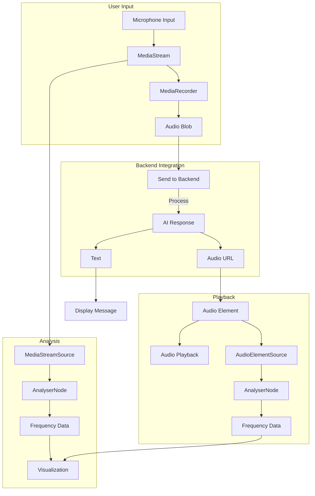
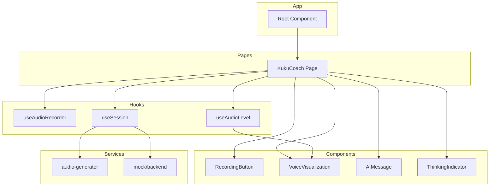
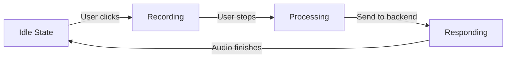
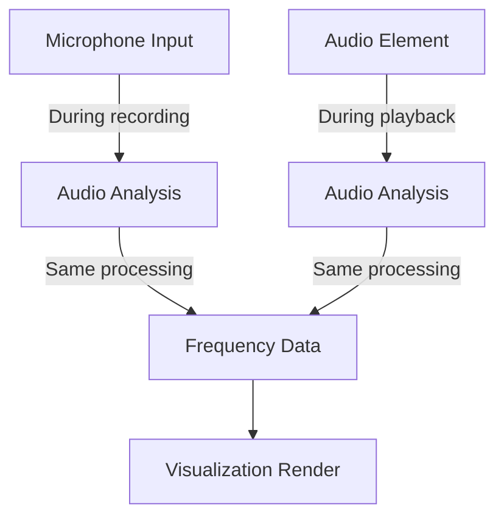

# System Patterns and Architecture

## Core Architectural Patterns

### Component Architecture
- **Atomic Design Pattern**: Breaking down UI into atoms, molecules, organisms, templates, and pages
- **Component-Based Architecture**: Each UI element is a reusable React component
- **Container/Presentational Pattern**: Separating logic from presentation concerns

### Data Flow
- **Context API for Global State**: SessionContext maintains global conversation state
- **Unidirectional Data Flow**: State flows down, events bubble up
- **Custom Hooks for Reusable Logic**: Encapsulating complex logic like audio handling in custom hooks

### Audio Processing Pipeline

## Key Design Patterns

### State Management
- **React Context API**: For global application state
- **useState**: For component-local state
- **useRef**: For maintaining references across renders
- **localStorage**: For persisting session data between page reloads

### Audio Processing Pattern
- **Web Audio API**: For real-time audio processing and analysis
- **Unified Analyzer Approach**: Same visualization logic for both record and playback
- **Frequency Band Analysis**: Splitting audio spectrum for more detailed visualization
- **Resource Lifecycle Management**: Careful tracking and cleanup of audio resources

### Asynchronous Patterns
- **Promise-based API interactions**: For audio processing and backend communication
- **React useEffect for Side Effects**: Managing audio lifecycle and playback
- **Exponential Backoff for Retries**: When handling potentially failing audio operations

### Error Handling Pattern
- **Try/Catch in Async Functions**: For capturing and handling errors
- **Fallback Mechanisms**: Providing alternatives when primary methods fail
- **Error Propagation**: Bubbling errors up to UI for user feedback

## Component Hierarchy

## Data Flow Architecture

### Conversation Flow

### Audio Visualization Flow
