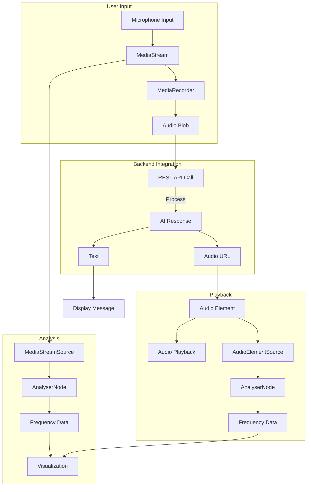
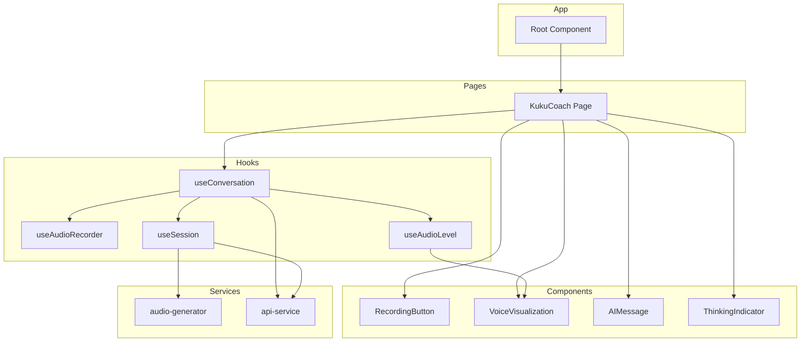
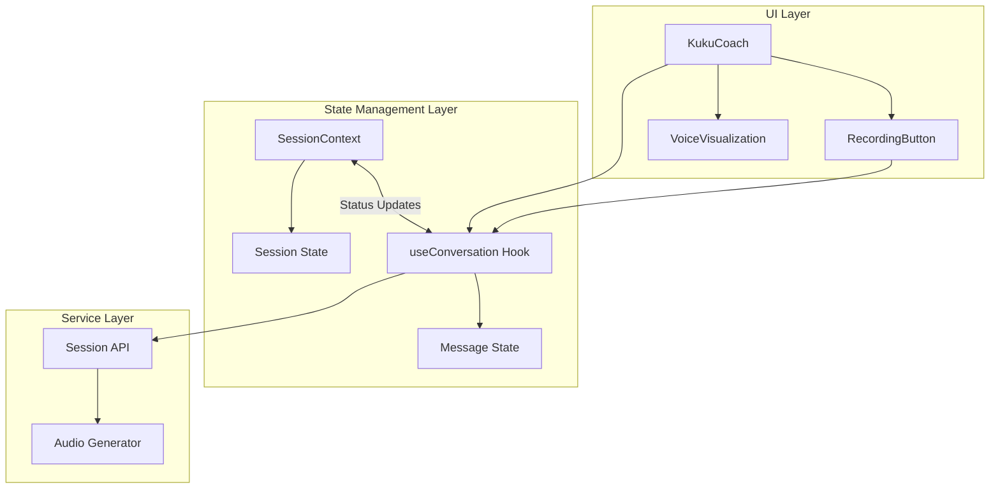
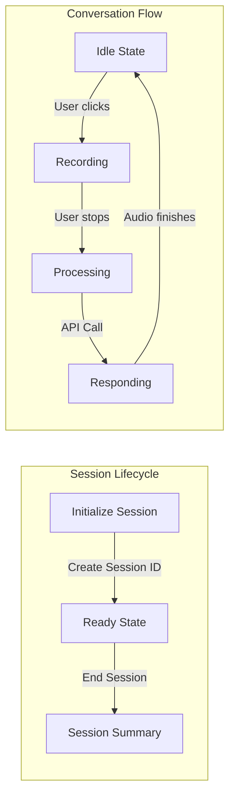
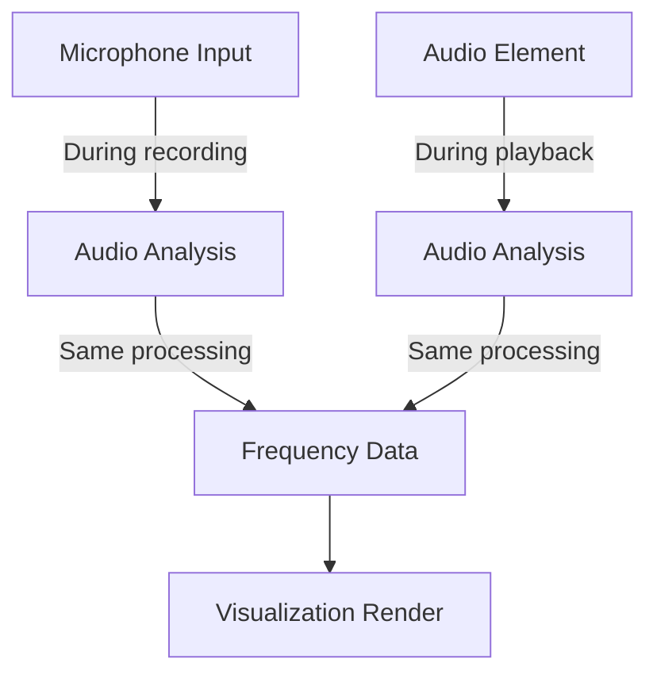

# System Patterns and Architecture

## Core Architectural Patterns

### Component Architecture
- **Atomic Design Pattern**: Breaking down UI into atoms, molecules, organisms, templates, and pages
- **Component-Based Architecture**: Each UI element is a reusable React component
- **Container/Presentational Pattern**: Separating logic from presentation concerns

### Data Flow
- **Context API for Global State**: SessionContext maintains global session state (not conversation history)
- **Custom Hooks for State Management**: useConversation maintains conversation state
- **Unidirectional Data Flow**: State flows down, events bubble up
- **Custom Hooks for Reusable Logic**: Encapsulating complex logic like audio handling in custom hooks

### Backend Communication Pattern
- **REST API with Session-Based Design**: REST API approach with clear separation from UI state
- **Session Initialization**: Create session before starting conversation
- **Audio Message Exchange**: Send audio with session context, receive text and audio responses
- **Conversation History**: Retrieve history based on session ID
- **Separation of Concerns**: UI state separate from backend communication

### Audio Processing Pipeline


## Key Design Patterns

### State Management
- **React Context API**: For global session state (status, ID)
- **Custom Hooks**: For conversation state management
- **useState**: For component-local state
- **useRef**: For maintaining references across renders
- **localStorage**: For persisting session data between page reloads

### Session Management
- **Session Initialization**: Create session ID at startup
- **Session Context**: Maintain session ID across interactions
- **Session Persistence**: Store session ID in localStorage
- **History Retrieval**: Fetch conversation history by session ID
- **Clear Separation**: Session UI state separate from conversation data

### Audio Processing Pattern
- **Web Audio API**: For real-time audio processing and analysis
- **Unified Analyzer Approach**: Same visualization logic for both record and playback
- **Frequency Band Analysis**: Splitting audio spectrum for more detailed visualization
- **Resource Lifecycle Management**: Careful tracking and cleanup of audio resources

### Asynchronous Patterns
- **Promise-based API interactions**: For audio processing and backend communication
- **React useEffect for Side Effects**: Managing audio lifecycle and playback
- **Exponential Backoff for Retries**: When handling potentially failing audio operations

### Error Handling Pattern
- **Try/Catch in Async Functions**: For capturing and handling errors
- **Fallback Mechanisms**: Providing alternatives when primary methods fail
- **Error Propagation**: Bubbling errors up to UI for user feedback

## Component Hierarchy



## New Architecture



## Data Flow Architecture

### Conversation Flow


### API Communication Flow
```mermaid
flowchart TD
    subgraph Session Management
        CS[Create Session] -->|POST /api/sessions/create| SID[Session ID]
        SID -->|Store in Context| READY[Ready State]
        READY -->|GET /api/sessions/{id}/history| HIST[Load History]
        READY -->|PUT /api/sessions/{id}/end| END[End Session]
    end
    
    subgraph Message Exchange
        REC[Audio Recording] -->|Record Complete| BLOB[Audio Blob]
        BLOB -->|POST /api/sessions/{id}/audio| PROC[Process Audio]
        PROC -->|Backend Processing| RESP[Response]
        RESP -->|Text & Audio URL| DISP[Display & Play]
    end
```

### Audio Visualization Flow
